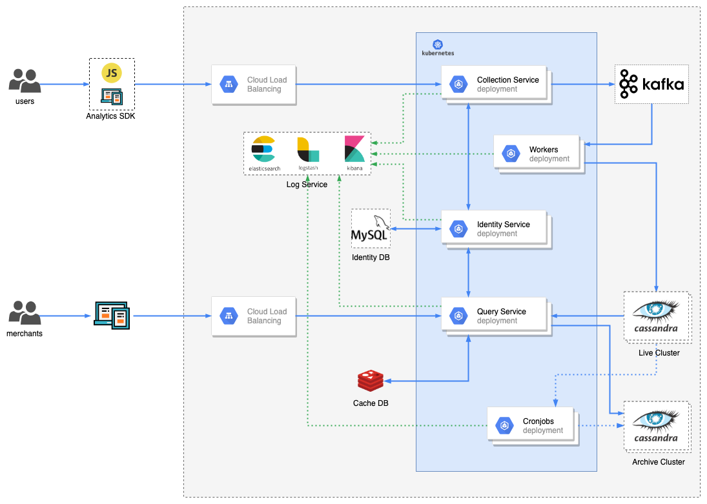

# Design Question
## Requirements
Design A Google Analytic like Backend System.
    We need to provide Google Analytic like services to our customers. Pls provide a high level solution design for the backend system. Feel free to choose any open source tools as you want.
	
	The system needs to:

	1) handle large write volume: Billions write events per day.
	
	2) handle large read/query volume: Millions merchants want to get insight about their business. Read/Query patterns are time-series related metrics. 
	
	3) provide metrics to customers with at most one hour delay.
	
	4) run with minimum downtime.
	
	5) have the ability to reprocess historical data in case of bugs in the processing logic.

## System Design

### Kubernates
Kubernates support autoscaling and rolling update. Use it to develop and manage our services (containers), help us easy to handle more and more requests and do rolling updates without downtime.

### Identity Service
Use for make sure all the requests can be authorized.

### Job Queue: Kafka + Workers
After all the analytic data requests are authorized. Push them into Kafka, and let workers to handle write and process data to Live DB. Avoid mass writing requests crash our Live DB.

### Live DB & Archive DB: Cassandra
- Cassandra have scalability, high availability and great writing performance. It is suitable for storing our analytic data.
- Regular delete old data and archive them to Archive DB can reduce search stress of Live DB.

### Cache DB: redis
Use redis to cache query result, helped us improve performance and reduce the load on our Live DB.

### Log Service: ELK stack
ELK is the acronym for three open source projects: Elasticsearch, Logstash, and Kibana. Use ELK to store logs, let us easily collect, trace and visualize logs.
- Elasticsearch for search and data analytics
- Logstash for centralized logging, log enrichment and parsing
- Kibana to visualize data
